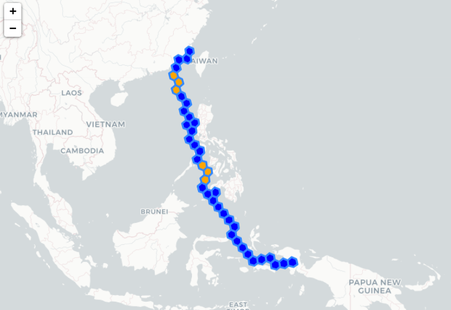

<!-- ABOUT THE PROJECT -->
## About The Project

This project grew out of the need to interpolate spatial gaps in [AIS data](https://en.wikipedia.org/wiki/Automatic_identification_system). It is known that AIS signals can be sporadic and inconsistent, especially in regions where authorities [block public access](https://www.ft.com/content/875f6d2d-b09d-406c-b97c-64f987481cf8) to location data.

However, few open-source maritime routing engines exist. The most notable is Eurostat’s Java-based application [SeaRoute](https://github.com/eurostat/searoute), which helped inspire this project. Our idea was to develop an application that was on one hand understandable and visually engaging, and on the other hand modern and containerized. We combined [H3](https://github.com/uber/h3) — a hierarchical geospatial indexing system — with the power of [neo4j](https://github.com/neo4j), a graph database.



### Built With

* [neo4j](https://neo4j.com/)
* [h3](https://github.com/uber/h3)

---

<!-- GETTING STARTED -->
## Getting Started

### Installation

```sh
docker-compose up -d --build
